<p align="center">
  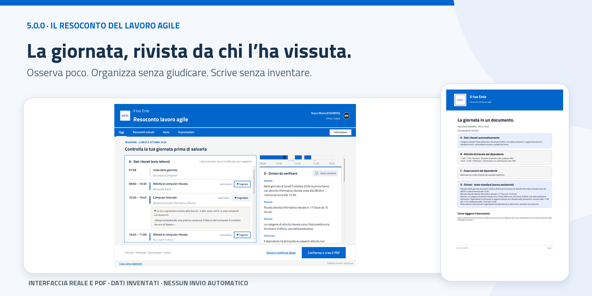
</p>

<h1 align="center">Smart Working Istituzionale</h1>
<p align="center"><b>La giornata, rivista da chi l’ha vissuta.</b><br>Il resoconto del lavoro agile per gli enti pubblici: poca raccolta, revisione del dipendente, PDF verificabile.</p>
<p align="center">
  
  <a href="LICENSE"></a>
  
  
  
  
</p>
<p align="center"><a href="PRIVACY.md"><b>Privacy tecnica</b></a> · <a href="SECURITY.md"><b>Sicurezza e sigilli</b></a> · <a href="docs/NOTE_5.0.0.md">Note 5.0.0</a> · <a href="CHANGELOG.md">Changelog</a></p>

Autore: **Luca Accorsi** · Windows, utente standard · documentazione in italiano · edizione pubblica **neutra**.
Il programma non invia automaticamente il resoconto. La consegna è una scelta manuale del dipendente, secondo le procedure dell’Ente.

<a id="dati"></a>
## Cosa registra / Cosa NON registra

| Registra, nel periodo avviato e fuori dalle pause | NON registra |
|---|---|
| Eventi della sessione Windows e relativi orari | Registro eventi storico di Windows |
| Presenza **sì/no** di attività informatica nella fascia | Tasti, testo digitato, movimenti del mouse, schermate |
| Programmi in primo piano **solo dell’elenco CED** | Titoli delle finestre, nomi/percorsi/contenuti dei file, programmi fuori elenco |
| Browser come categoria di programma | Indirizzi, siti visitati o cronologia; contenuti, destinatari o conteggi della posta |
| Attività, segnalazioni e osservazioni inserite dal dipendente | Classifiche, punteggi, produttività o durate di lavoro dedotte |
| Snapshot tecnico **opzionale**, solo nel livello tecnico | IP, MAC, SID, seriali o account tecnico |

**Nessuna attività informatica rilevata non significa assenza di lavoro.** Una riunione, una telefonata o il lavoro su carta possono non lasciare segnali sul PC. Le applicazioni presenti nella stessa fascia non producono durate da sommare.

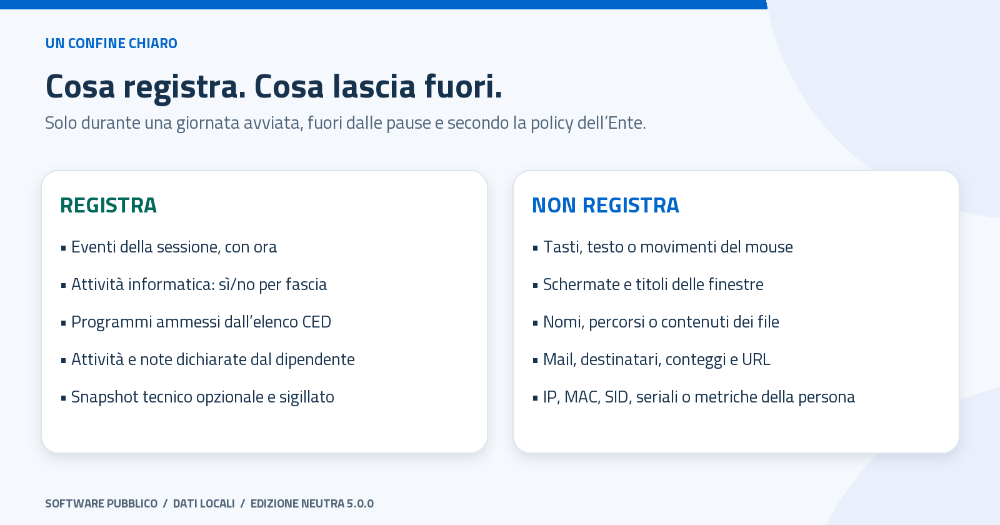

> [!IMPORTANT]
> **Prima dell’uso con dipendenti servono gli adempimenti dell’Ente.** Leggi i [prerequisiti obbligatori](#prerequisiti): non sono sostituiti dall’installazione, dalla presa visione nell’app o da un sigillo valido. Il progetto non dichiara conformità giuridica.

<a id="indice"></a>
## Indice

[Novità 5.0.0](#novita) · [Tre principi](#principi) · [Flusso](#flusso) · [Galleria](#galleria) · [JSON e dati locali](#json) · [AI locale](#ai) · [Verificatore](#verificatore) · [Due edizioni e overlay](#edizioni) · [Installazione e Setup](#installazione) · [Accessibilità e limiti](#limiti) · [Prerequisiti](#prerequisiti) · [Sviluppo](#sviluppo) · [English summary](#english)

<a id="novita"></a>
## Novità 5.0.0

| Novità | Cosa cambia nell’uso |
|---|---|
| **Due edizioni, un solo codice** | La base pubblica usa «Il tuo Ente», un simbolo generico e palette neutra AgID. Un’edizione istituzionale privata applica nome, logo e testi tramite overlay locale; il codice non incorpora identità dell’Ente. |
| **JSON minimizzato a segnali** | Fasce configurate dal CED (15 minuti di default), categorie e segnali. Nessuna durata sommata per programma, classifica o misura del rendimento della persona. Gli orari delle attività dichiarate restano indicativi e separati. |
| **Provenienza esplicita** | Rilevato, dichiarato e testo AI hanno etichette riconoscibili. L’AI riformula i fatti, non diventa una fonte di nuovi dati. Le note e le segnalazioni accompagnano i dati automatici senza riscriverli. |
| **Snapshot tecnico separato** | Nome macchina, tipo VDI/PC fisso, sistema operativo/versione, processore e RAM: opzionali, sigillati nel JSON e nella nota metodologica del PDF. Mai all’AI o nella pagina 1. |
| **AI facoltativa e comprensibile** | Sintesi su richiesta in locale. Se manca runtime o modello, la RAM libera è insufficiente o l’accesso è negato, l’app spiega la causa in italiano e propone il testo standard o l’intervento dei Sistemi Informativi. |
| **Rete disattivata** | Il sensore SMB e il riconoscimento Halley sono esclusi dall’edizione operativa: il PoC non è un sensore validato su un’infrastruttura reale. Non si riattivano dalle impostazioni del dipendente. |
| **Interfaccia e PDF rinnovati** | Intestazione ampia, schede, timeline di segnali e copertina del PDF. Effetti brevi, fino a 30 fps, riducibili e sospesi quando la finestra non è in primo piano o dopo inattività. |
| **Setup 5.0.0** | Inno Setup per utente, immagini dell’edizione selezionata e controllo dello spazio libero prima della build. Nessun bootstrapper personalizzato. |

> **Cambio di formato:** il JSON sigillato è `rendiconto-sw/giornaliero/5`, incompatibile con i formati precedenti. Non si convertono o risigillano automaticamente i vecchi documenti. I renderer storici restano separati per verificarli, nei limiti della configurazione disponibile.

<a id="principi"></a>
## Tre principi

1. **Il Collector osserva poco.** Sessione, attività informatica sì/no e programmi ammessi, solo nel periodo della giornata avviata e fuori dalle pause.
2. **L’Aggregator organizza, non giudica.** Ordina segnali in fasce e categorie; non deduce qualità del lavoro o produttività della persona.
3. **L’AI scrive, non inventa.** Riceve fatti minimizzati, con provenienza, su `127.0.0.1`. Il controllo anti-invenzione e il testo standard riducono gli errori; la verifica umana resta necessaria.

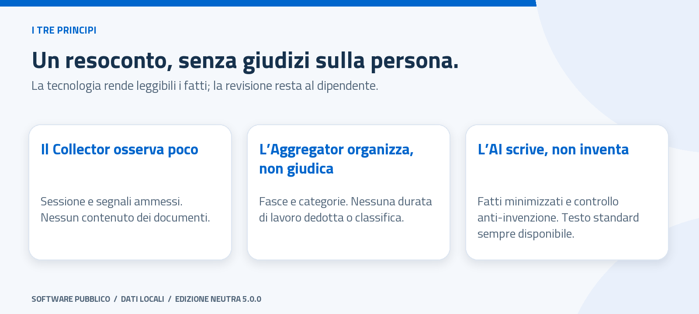

<a id="flusso"></a>
## La giornata, passo per passo

**Avvia → Pausa/Riprendi → Chiudi → Rivedi → Conferma → Consegna manualmente.**

Alla chiusura l’aggregatore produce il JSON minimizzato e il sigillo tecnico. In revisione il dipendente può segnalare un dato, aggiungere attività, scrivere osservazioni e verificare la sintesi; i dati automatici restano in sola lettura. La conferma produce il sigillo finale e il PDF con `resoconto.json` allegato.

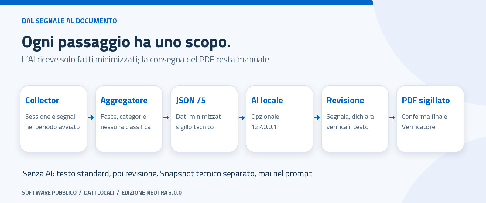

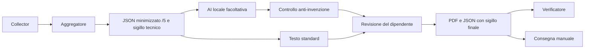
```mermaid
flowchart LR
    C[Collector] --> A[Aggregatore]
    A --> J[JSON minimizzato /5 e sigillo tecnico]
    J --> L[AI locale facoltativa]
    J --> S[Testo standard]
    L --> V[Controllo anti-invenzione]
    V --> R[Revisione del dipendente]
    S --> R
    R --> P[PDF e JSON con sigillo finale]
    P --> K[Verificatore]
    P --> M[Consegna manuale]
```

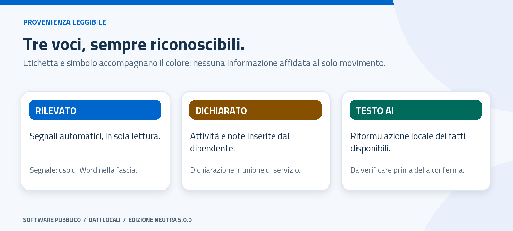

<a id="galleria"></a>
## L’app e il PDF, con dati inventati

Finestre **reali della 5.0.0**, non disegni dell’interfaccia. «Rossi Maria (ESEMPIO)», `PC-ESEMPIO` e `C:\Users\utente\…` sono valori fittizi. Le catture usano la modalità consuntivo e dati sintetici, senza osservare l’operatore. Le catture statiche usano effetti ridotti per essere leggibili; la GIF mostra movimento reale. I crediti dell’autore restano attribuzioni del software.

<table>
<tr>
<td width="50%"><a href="docs/screenshots/00_splash.png">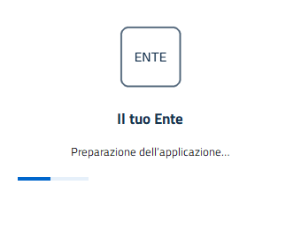</a><br><sub><b>Splash</b> · dati inventati</sub></td>
<td width="50%"><a href="docs/screenshots/02a_home_giornata_da_avviare.png">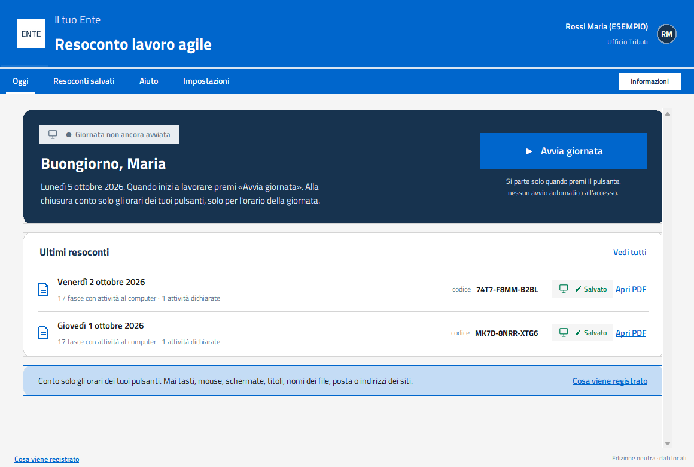</a><br><sub><b>Home</b> · dati inventati</sub></td>
</tr>
<tr>
<td width="50%"><a href="docs/screenshots/02_home_giornata_in_corso.png">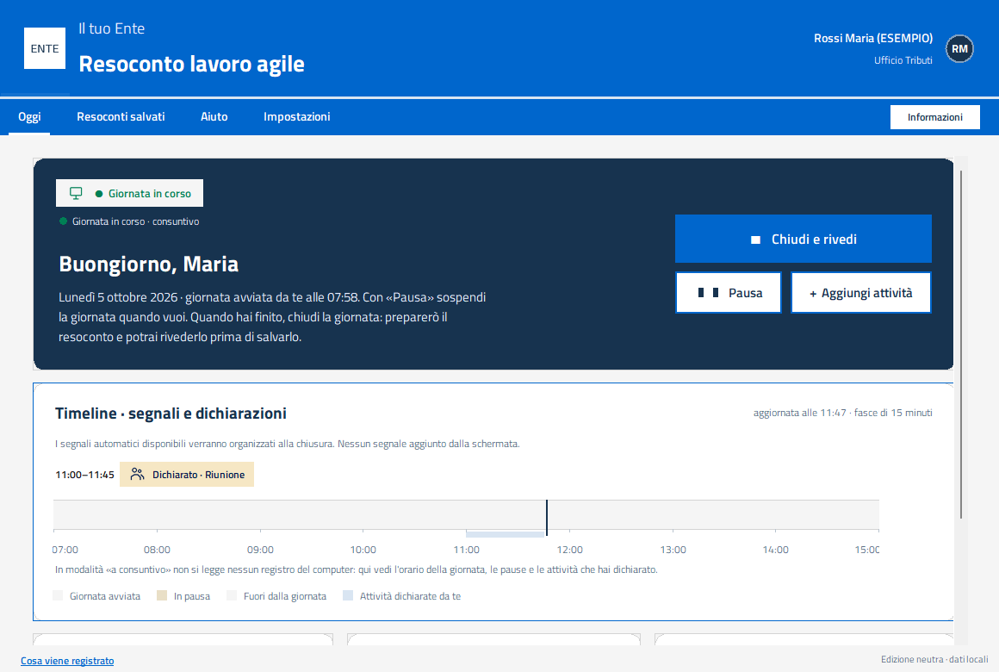</a><br><sub><b>Giornata attiva</b> · dati inventati</sub></td>
<td width="50%"><a href="docs/screenshots/04d_revisione_verificata.png">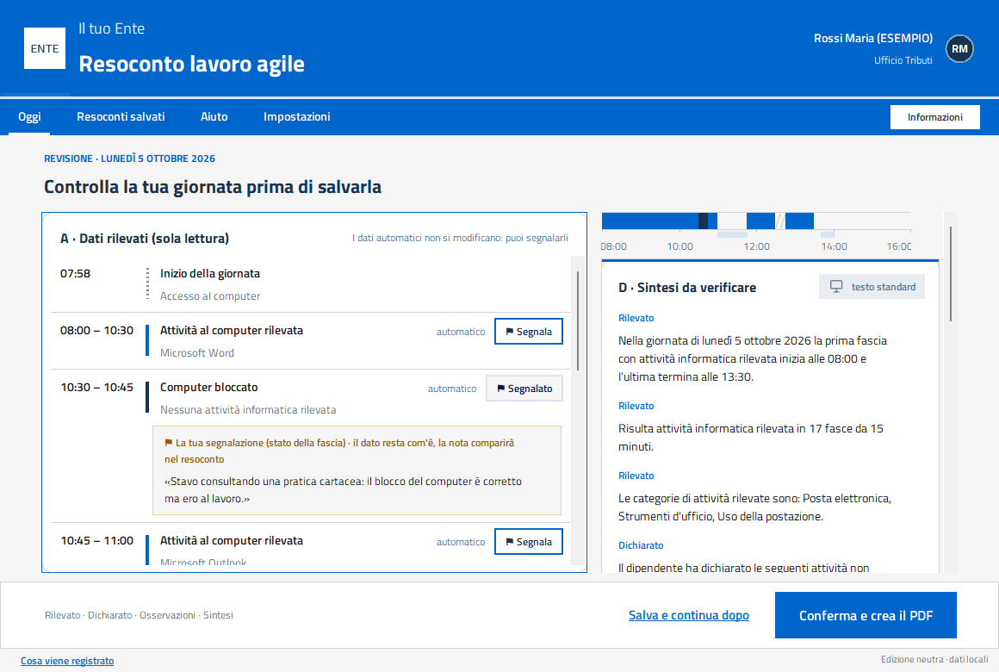</a><br><sub><b>Revisione</b> · dati inventati</sub></td>
</tr>
<tr>
<td width="50%"><a href="docs/screenshots/02c_aggiungi_attivita.png">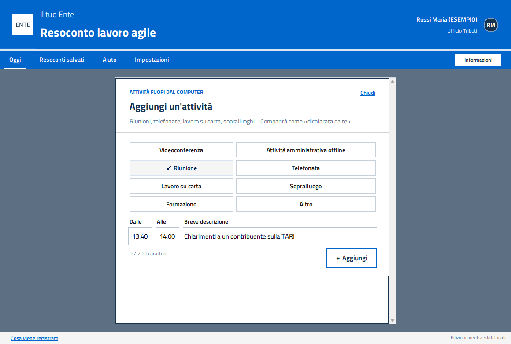</a><br><sub><b>Attività manuale</b> · dati inventati</sub></td>
<td width="50%"><a href="docs/screenshots/07c_impostazioni.png">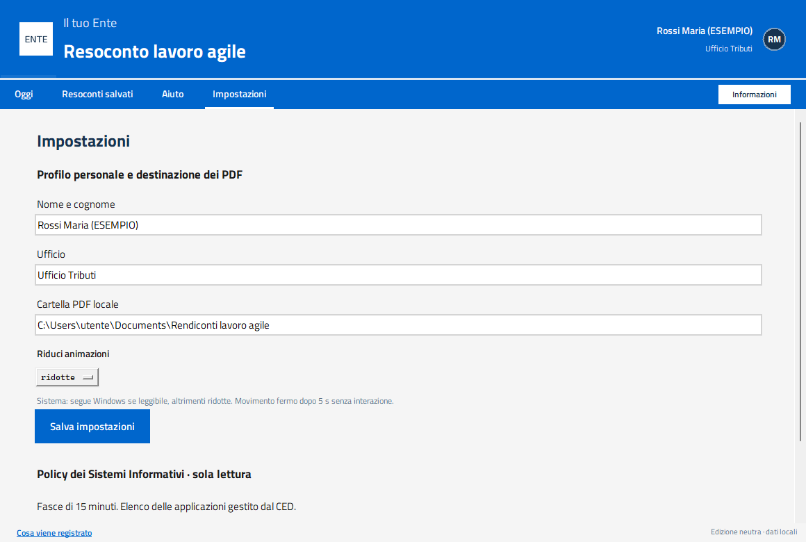</a><br><sub><b>Impostazioni</b> · dati inventati</sub></td>
</tr>
<tr>
<td width="50%"><a href="docs/screenshots/10_verificatore_valido.png">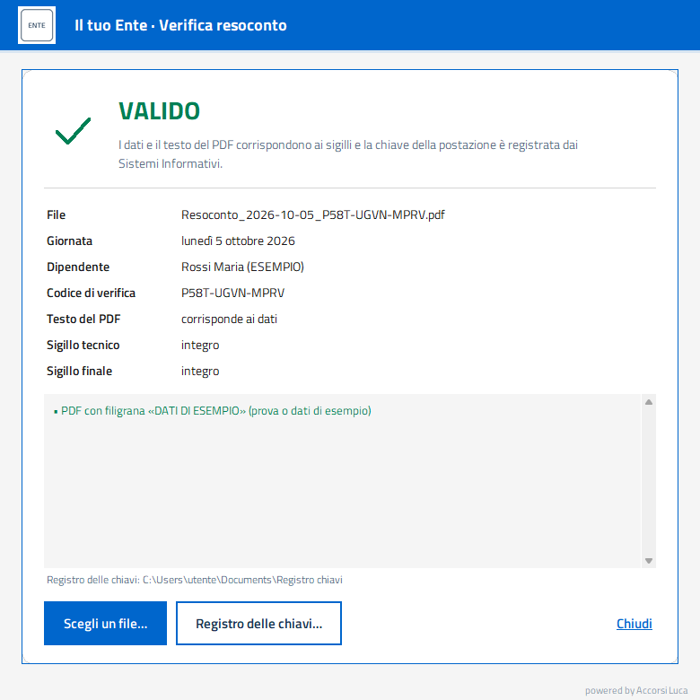</a><br><sub><b>Verificatore VALIDO</b> · dati inventati</sub></td>
<td width="50%"><a href="docs/screenshots/10b_verificatore_alterato.png">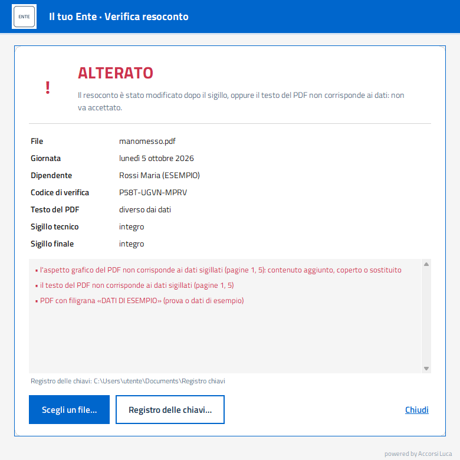</a><br><sub><b>Verificatore ALTERATO</b> · dati inventati</sub></td>
</tr>
<tr>
<td width="50%"><a href="docs/screenshots/pdf_pagina-1.png">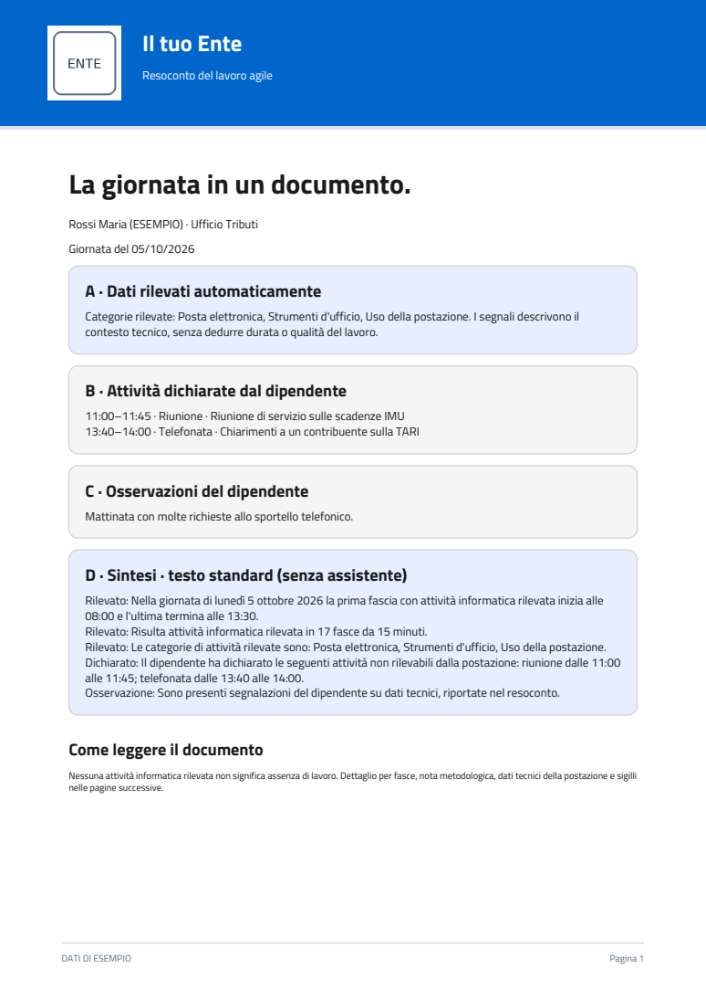</a><br><sub><b>PDF · pagina 1</b> · dati inventati</sub></td>
<td width="50%"><a href="docs/screenshots/pdf_pagina-6.png">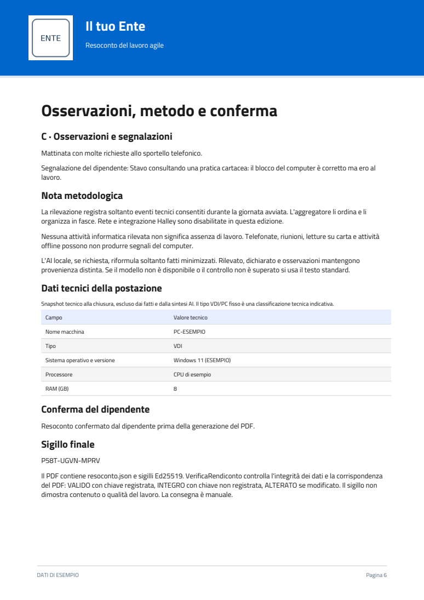</a><br><sub><b>PDF · nota metodologica</b> · dati inventati</sub></td>
</tr>
</table>

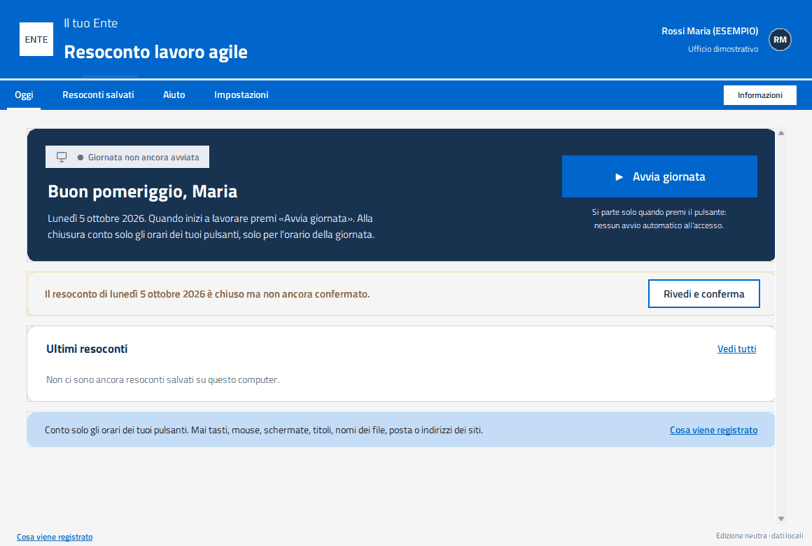

<details>
<summary><b>Tutte le pagine del PDF e le schermate di supporto</b></summary>

<table>
<tr>
<td width="50%"><a href="docs/screenshots/pdf_pagina-1.png"></a></td>
<td width="50%"><a href="docs/screenshots/pdf_pagina-2.png">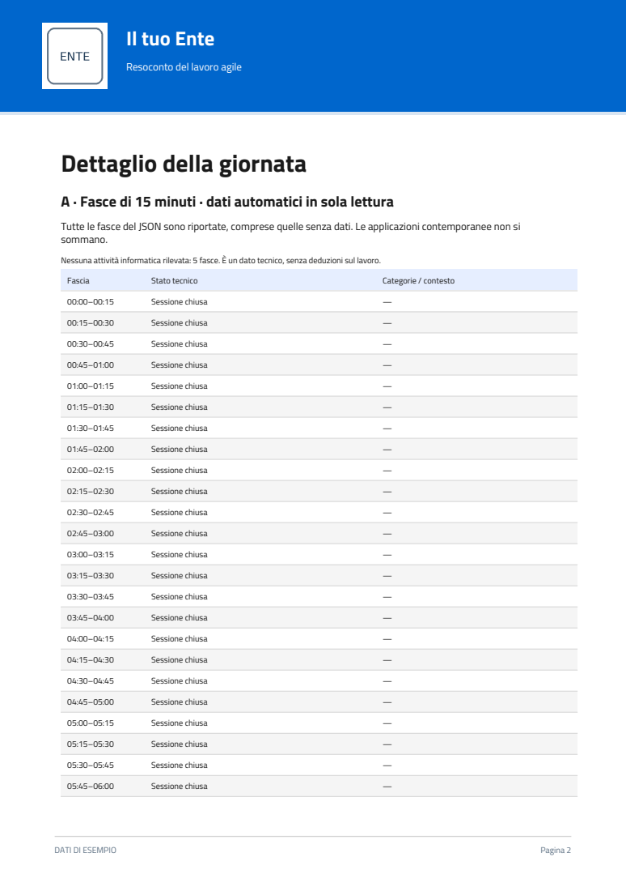</a></td>
</tr>
<tr>
<td width="50%"><a href="docs/screenshots/pdf_pagina-3.png">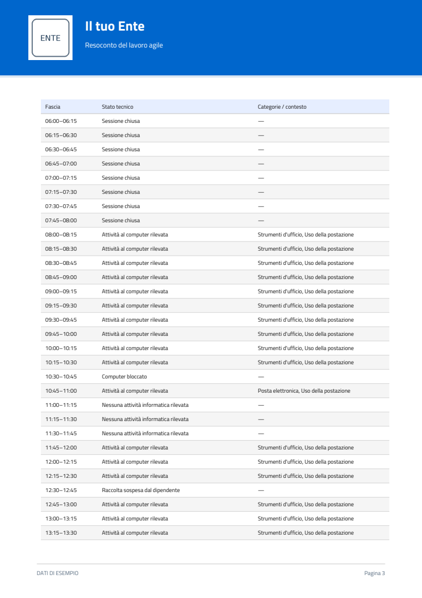</a></td>
<td width="50%"><a href="docs/screenshots/pdf_pagina-4.png">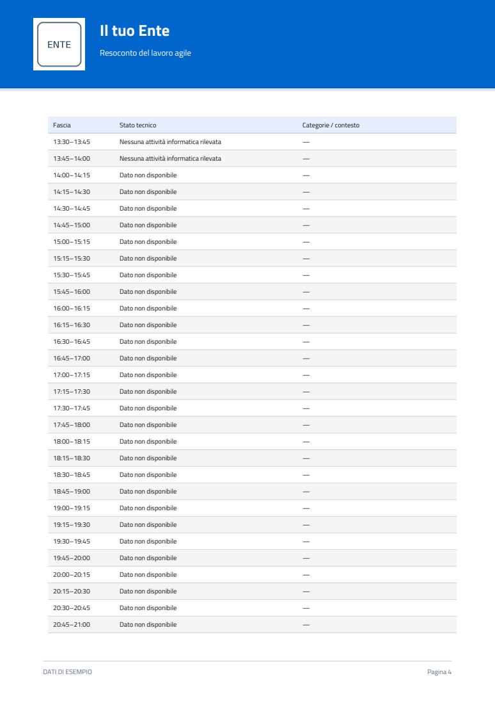</a></td>
</tr>
<tr>
<td width="50%"><a href="docs/screenshots/pdf_pagina-5.png">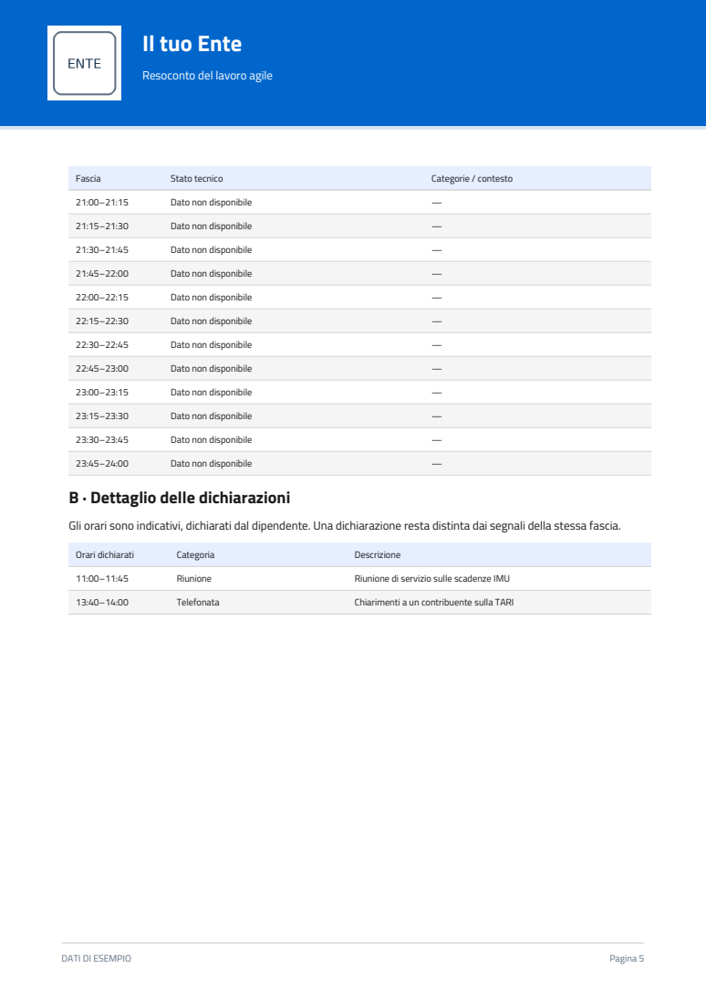</a></td>
<td width="50%"><a href="docs/screenshots/pdf_pagina-6.png"></a></td>
</tr>
</table>

[PDF completo di esempio](docs/screenshots/resoconto_esempio_2026-10-05.pdf) · [Informativa del primo avvio](docs/screenshots/01_informativa_primo_avvio.png) · [Cosa viene registrato](docs/screenshots/07b_cosa_viene_registrato_collector.png) · [Sintesi con avvisi](docs/screenshots/04b_modifica_sintesi_con_avvisi.png) · [Segnala un dato](docs/screenshots/04c_segnala_dato.png) · [Resoconti salvati](docs/screenshots/08_resoconti_salvati.png) · [Aiuto](docs/screenshots/09_aiuto.png)

</details>

[Mockup neutri](docs/mockup-tornata/neutra/index.html) · [Effetti fedeli o approssimati in Tk e misure CPU/RAM](docs/MOVIMENTO.md) · [Come rigenerare le catture senza percorsi reali](docs/CATTURE_DI_ESEMPIO.md).

<a id="json"></a>
## JSON minimizzato e dati locali

Il PDF incorpora il documento sigillato `resoconto.json`. Lo [schema /5](schema/giornaliero.schema.json) comprende giornata/fuso, identità funzionale del dipendente, contesto di sessione, fasce e categorie, dichiarazioni, osservazioni, avvisi, sintesi con provenienza e sigilli. Include anche l’identità documentale (nome dell’Ente, palette e impronta del logo) necessaria a ricostruire la grafica.

**Account di Windows e hostname non vengono aggiunti dai sigilli nuovi.** Il nome macchina e la RAM possono comparire esclusivamente nello snapshot tecnico opzionale: non sono fatti per la sintesi. `config/ente.json` → `dati_tecnici_postazione: false` evita anche la lettura dello snapshot; default attivo. Il tipo VDI/PC fisso è una classificazione euristica, non una certificazione della postazione.

<details>
<summary><b>Dati, destinazione e confine con l’AI</b></summary>

| Livello | Contenuto | Destinazione |
|---|---|---|
| Raw | Solo campi ammessi di sessione, input sì/no e programmi filtrati | Base locale, non passato direttamente all’AI |
| JSON /5 | Fasce, segnali e dati rivisti; niente durate aggregate per programma | JSON locale e allegato sigillato al PDF |
| Fatti per la sintesi | Elenco deterministico con provenienza; può includere le descrizioni dichiarate | AI locale, oppure testo standard |
| Snapshot tecnico opzionale | `nome_macchina`, `tipo`, `sistema_operativo`, `processore`, `ram_gb` | Solo livello tecnico del JSON e ultima parte del PDF; mai AI |
| Chiave privata | Ed25519, protetta da DPAPI su Windows | Cartella chiave locale; non nel PDF né nel repository |
| Diagnostica | Stato e risorse del processo di raccolta, non della persona | Cartella locale; non resoconto o prompt |

</details>

La base predefinita è in `%LOCALAPPDATA%\RendicontoSW`; contiene raw, giornate, revisioni, finali, stato, chiave e diagnostica. I PDF vanno nella cartella locale scelta dal dipendente (default Documenti → Rendiconti lavoro agile). La disinstallazione conserva i dati.

**Conservazione:** di default la policy raw ha periodo e decorrenza null, quindi nessuna cancellazione automatica. Il CED può validare e configurare una policy limitata ai raw nuovi di giornate confermate e integre; non elimina PDF, JSON, revisioni o chiavi. Dettagli e protezioni in [PRIVACY.md](PRIVACY.md).

<a id="ai"></a>
## AI locale, opzionale

Il flusso funziona senza AI. Il pulsante di sintesi richiede un runtime `llama.cpp` e un modello già predisposti dal CED; il motore usa solo HTTP su **127.0.0.1**, senza proxy o redirect esterni. Nessun cloud, telemetria o download a runtime. La AI riceve l’elenco dei fatti di `redattore/fatti.py`, non tutto il JSON, l’hardware o i file dell’utente.

La selezione **LIGHT/STANDARD** considera configurazione, modello installato, RAM totale e memoria libera. LIGHT è l’opzione conservativa per una postazione da 8 GB; la disponibilità effettiva va collaudata. Le risorse diagnostiche usate per scegliere il profilo non diventano fatti della giornata.

Se l’assistente manca, il modello non è installato, la memoria libera non basta o i permessi non consentono l’accesso, compare una causa in parole semplici e l’indicazione di cosa fare. Il **fallback deterministico resta disponibile**. Il controllo anti-invenzione non certifica ogni frase: il dipendente verifica il testo, e le modifiche dichiarate mantengono origine e avvisi.

Rete e Halley rimangono disabilitati: nessun sensore SMB istanziato e nessuna estensione distribuita o attivabile dall’utente. Una loro futura attivazione richiederebbe decisione dell’Ente, verifica privacy e validazione tecnica dedicata; non basta cambiare una spunta.

<a id="verificatore"></a>
## Il sigillo e i quattro esiti

| Esito | Significato |
|---|---|
| **VALIDO** | Sigilli integri e chiave pubblica registrata; per il PDF anche i confronti richiesti di testo e grafica sono riusciti. |
| **INTEGRO** | Integrità dimostrabile, ma chiave non registrata oppure confronto grafico non disponibile: non equivale a VALIDO. |
| **ALTERATO** | Firma/dati o contenuto visibile del PDF non corrispondono; il Verificatore mostra i motivi. |
| **NON SIGILLATO** | Manca il sigillo finale richiesto o il JSON allegato al PDF. |

Il sigillo attesta l’integrità del documento, **non qualità, verità o rendimento del lavoro**. Il registro delle chiavi pubbliche segue una procedura dell’Ente. Versione del renderer e identità grafica disponibili possono limitare la verifica di documenti storici; non si promette VALIDO se il confronto non è eseguibile. [Modello di sicurezza](SECURITY.md).

<a id="edizioni"></a>
## Due edizioni, un solo codice

**Pubblica:** «Il tuo Ente», simbolo geometrico generico, palette neutra AgID `#0066CC` e derivati. **Istituzionale privata:** nome, logo, colori e testi autorizzati dell’Ente in un overlay locale. Nessun overlay privato è distribuito qui.

Creare `edizioni/<id>/` con `ente.json`, `design_tokens.json`, `identita.json` e logo, usando la base `config/` come esempio. Selezionare l’overlay **prima dell’avvio**, tramite `RENDICONTO_EDIZIONE` o `config/edizione.json`; riavviare dopo una modifica. La build materializza solo l’identità selezionata, senza includere gli altri overlay. [Struttura e comandi](docs/EDIZIONI.md).

**Nome e logo/stemma dell’Ente adottante non sono coperti dalla EUPL.** Diritti e autorizzazioni restano del titolare. Conservare proporzioni e qualità del logo; per PDF ad alta risoluzione preferire una versione vettoriale autorizzata.

<a id="installazione"></a>
## Installazione, requisiti e Setup

**Per utilizzare gli eseguibili:** Windows 10/11, utente standard, spazio locale sufficiente. Python non è richiesto al destinatario del pacchetto PyInstaller. Il Setup e i modelli AI vanno procurati separatamente: non sono inclusi nel repository. L’AI richiede ulteriore memoria e il collaudo della postazione.

**Da sorgente o per sviluppo:** Python **3.12 con Tk**, verificato in questa tornata, e dipendenze di `requirements.txt`. Python 3.13 e altre piattaforme non sono dichiarati collaudati dalla suite Windows di questa versione.

```powershell
python -m pip install -r requirements.txt
$env:RENDICONTO_EDIZIONE = 'neutra'
python -m applicazione
# Verificatore indipendente:
python -m verificatore
```

<details>
<summary><b>Build, pacchetto, installazione e disinstallazione</b></summary>

```powershell
powershell -NoProfile -File tools/pacchetto/build_app.ps1 -Edizione neutra
# Preparare poi il pacchetto con runtime/modelli autorizzati:
# tools/pacchetto/prepara_alfa.ps1 (parametri nella documentazione)
# Compilare il Setup Inno dalla cartella del pacchetto:
# tools/pacchetto/setup/compila_setup.ps1
```

Il nome tecnico del Setup è `Setup_RendicontoSW_5.0.0.exe`, indipendente dall’edizione. Inno standard, senza bootstrapper: immagini, testi e pagina finale configurabili. La build controlla lo spazio libero prima della compressione. Parametri e codici di uscita in [LEGGIMI_SETUP.md](tools/pacchetto/setup/LEGGIMI_SETUP.md).

Installazione per utente in `%LOCALAPPDATA%\Programs\RendicontoSW`, collegamenti Start e voce in App installate (HKCU). Nessun servizio o attività pianificata; nessuna esclusione antivirus aggiunta dal Setup. Disinstallazione da App installate o `disinstalla.ps1`: i dati sono conservati. L’opzione separata `-RimuoviDati` richiede conferme per categoria e non elimina i PDF in Documenti. Runtime e modelli: versioni/licenze e impronte in [THIRD_PARTY_NOTICES.md](THIRD_PARTY_NOTICES.md).

</details>

> [!WARNING]
> **Firma del codice e ASR/Defender:** gli eseguibili di sviluppo e il Setup non sono firmati. Le policy possono bloccare avvio o processi figli. Prima della distribuzione servono firma del codice, approvazioni e prova pilota; non disabilitare o aggirare le protezioni. Un’esclusione in collaudo non dimostra compatibilità con una VDI gestita.

<a id="limiti"></a>
## Accessibilità, animazioni e limiti

Tab/Maiusc+Tab spostano il focus, Invio/Spazio attivano i controlli e Esc chiude i pannelli sovrapposti. Focus visibile, pannelli scorrevoli e scale applicative 100–150%. Testo ed etichette accompagnano sempre icone, colore e movimento.

**Riduci animazioni** segue Windows se l’impostazione è leggibile; altrimenti riduce gli effetti. Splash, transizioni, feedback e indicatori sono brevi o funzionali, senza lampeggi; massimo 30 fps, fermi in background o dopo 5 secondi senza interazione. Nessun contatore della persona animato. In Tk alcuni effetti sono approssimati: [fedeltà, durata e misure reali CPU/RAM](docs/MOVIMENTO.md). La simulazione con limite di 8 GB non sostituisce un collaudo su VDI reale.

Dopo un riavvio la raccolta non riparte automaticamente: serve l’intervento del dipendente. Una fonte non disponibile va letta come limite tecnico, mai come inattività. Non tutte le combinazioni Windows/VDI/EDR/scaling sono verificate; il pilota resta indispensabile.

<a id="prerequisiti"></a>
## Prerequisiti obbligatori prima dell’uso con dipendenti

> [!IMPORTANT]
> **Tutti a cura dell’Ente adottante, prima dell’esercizio.** Questi sono requisiti di adozione del progetto; l’Ente e il DPO devono determinare l’applicabilità delle singole procedure normative. La presa visione nell’app non è consenso, né sostituisce informativa o adempimenti organizzativi.

1. **Procedura dell’art. 4 L. 300/1970:** valutazione e completamento della procedura applicabile, con accordo RSU/RSA o autorizzazione dell’Ispettorato dove richiesti. La modalità collector rileva automaticamente segnali dell’uso del PC, anche se minimizzati. [Statuto dei lavoratori](https://www.normattiva.it/eli/id/1970/05/27/070U0300/CONSOLIDATED).
2. **DPIA**, valutazione d’impatto, con finalità, rischi e garanzie documentati.
3. **Informativa ai dipendenti**, art. 13 GDPR, e adeguata informazione sulle modalità d’uso e dei controlli ai sensi dell’art. 4, comma 3.
4. **Parere del DPO**, con valutazione di base giuridica, ruoli e accessi.
5. **Conservazione:** periodi e decorrenza approvati per ogni livello; di default nessuna cancellazione automatica dei raw, e mai cancellazione automatica di PDF/JSON/chiavi.
6. **Firma digitale del codice** per eseguibili e Setup, regole antivirus/EDR concordate, senza esclusioni locali o aggiramenti delle protezioni in distribuzione.
7. **Prova pilota** su postazioni reali e VDI prima della diffusione.
8. **Clausole** nel regolamento del lavoro agile e nell’accordo individuale, con dati trattati, finalità e garanzie.

[GDPR, artt. 13, 35 e 37–39](https://eur-lex.europa.eu/eli/reg/2016/679/oj/ita). Software fornito **«così com’è»**, senza garanzia EUPL: progettato per minimizzazione e privacy by design, **non certificato né dichiarato conforme**. L’adozione concreta resta responsabilità dell’Ente.

<a id="sviluppo"></a>
## Sviluppo, verifiche e documentazione

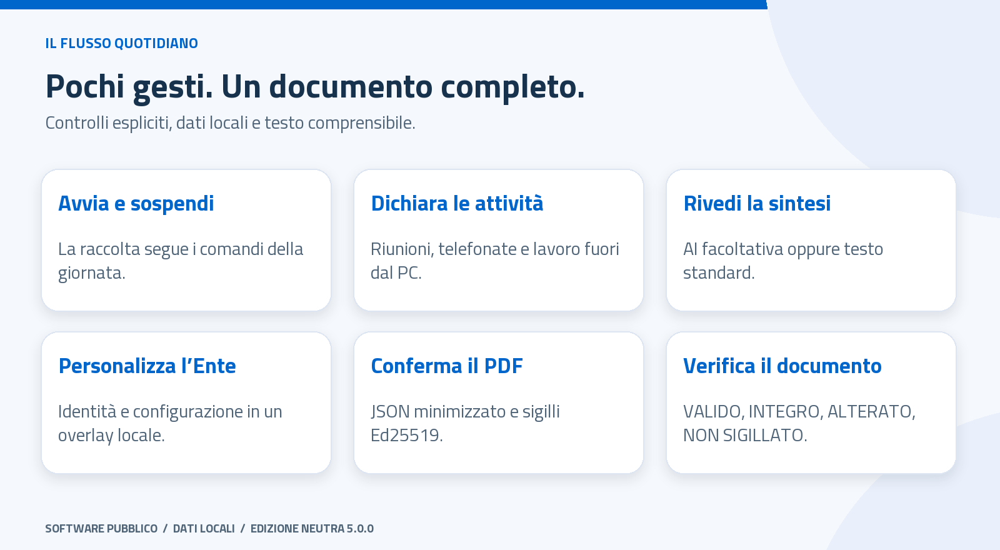

```powershell
python -m pytest -q
python tools/schermate_documentazione.py --edizione neutra --uscita docs/screenshots
python tools/crea_gif_documentazione.py --edizione neutra --uscita docs/screenshots
python tools/genera_presentazione.py
```

**560 test locali passati** sulla base 5.0.0: minimizzazione, loopback, provenienza, fallback, sigilli, alterazioni, configurazione, packaging e UI. Il badge indica una verifica locale, non un risultato di CI o una certificazione. Una sessione Tk indisponibile può far saltare i test grafici; verificare i casi saltati, non contarli come passati.

<details>
<summary><b>Mappa del codice e fonti delle affermazioni</b></summary>

| Cartella | Ruolo |
|---|---|
| `collector/` | Raccolta consentita, comandi della giornata e snapshot tecnico opzionale |
| `aggregatore/` | Eventi → fasce/segnali, schema minimizzato e sigilli Ed25519 |
| `redattore/` | Fatti con provenienza, modello locale, controllo e testo standard |
| `applicazione/`, `verificatore/` | Interfacce Tk e servizi locali |
| `resoconto/` | PDF e verifica, renderer storici separati |
| `config/`, `schema/` | Base neutra, policy CED e contratto JSON /5 |
| `tools/` | Build, Setup, catture protette e asset riproducibili |
| `tests/`, `examples/` | Regressioni e dati sintetici; nessuna chiave privata distribuita |

[Riferimenti verificati sul codice](docs/README_RIFERIMENTI.md). I moduli PoC e gli esempi storici non descrivono le funzioni attive della 5.0.0.

</details>

[PRIVACY](PRIVACY.md) · [SECURITY](SECURITY.md) · [Contribuire](CONTRIBUTING.md) · [Licenze terze parti](THIRD_PARTY_NOTICES.md) · [AUTHORS](AUTHORS) · [publiccode.yml](publiccode.yml) · [Asset e social preview](docs/PRESENTAZIONE.md).

<a id="english"></a>
## English summary

**Smart Working Istituzionale** (internal module name: Rendiconto SW) is an EUPL-1.2 Windows desktop tool for public bodies. It helps an employee prepare, review and manually deliver a daily remote-work report. The collector runs only during a started day, outside pauses: session events, a yes/no activity signal per slot and administrator-approved foreground programs. It does not record keystrokes, screens, window titles, file contents, email data, web addresses or personal performance scores. Network collection and site recognition are disabled in this edition.

Version 5.0.0 uses a minimised, Ed25519-sealed JSON format and keeps detected signals, employee declarations and generated text distinct. The optional technical snapshot is sealed and shown only in the technical section; it never reaches the AI. A local-only AI on **127.0.0.1** may rephrase minimised facts; a deterministic standard text remains available. The employee reviews the summary before producing the sealed PDF. Nothing is sent automatically. A neutral public edition and private institutional overlays share the same code.

**Before use with employees, the adopting body must complete the prerequisites above**: applicable Workers’ Statute art. 4 procedure, DPIA, privacy notice, DPO opinion, retention policy, code signing, real-workstation pilot and contractual clauses. The software is provided as is; it is designed for data minimisation but is **not certified or declared legally compliant**. Documentation is in Italian.

---

Copyright © 2026 Luca Accorsi. Software libero **EUPL-1.2** ([LICENSE](LICENSE)). Nome e logo/stemma dell’Ente adottante non sono coperti dalla licenza del software.
